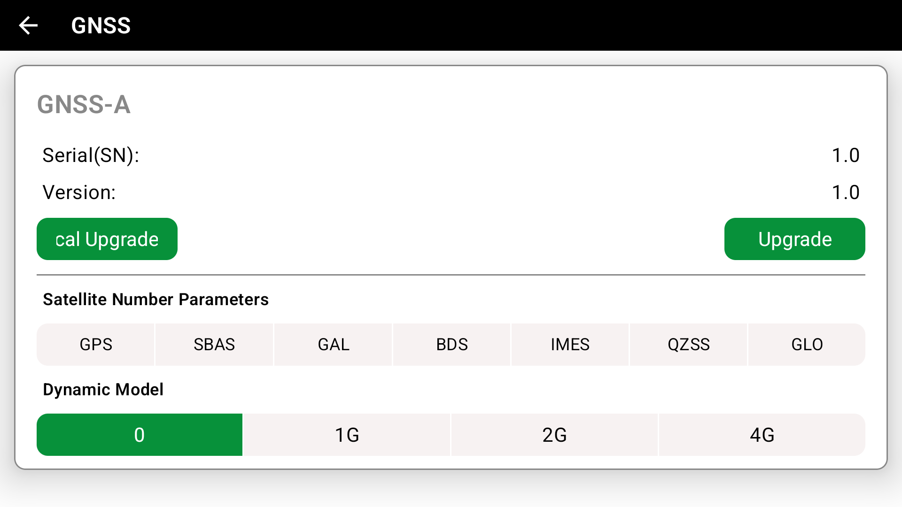
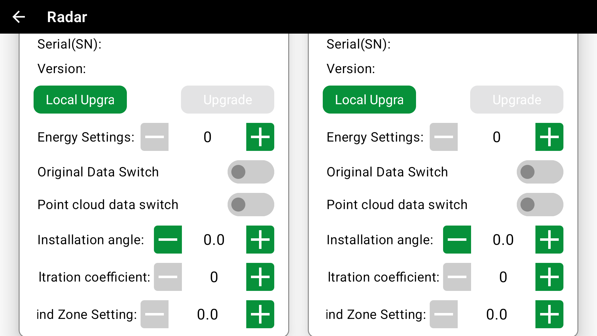

# V9 SDK Release Notes

## SDK Version Information

### Current Version
- **Version**: v0.0.5
- **Release Date**: 2025-11-14

### Version History
| Version | Release Date | Main Changes                                                             |
|---------|--------------|--------------------------------------------------------------------------|
| v0.0.5  | 2025-11-14   | Added parameter settings, alarms, commands, and performance optimization |

---

## 🔧 Firmware Compatibility

### Supported Firmware Versions
| SDK Version | Recommended PMU Firmware | Recommended FMU Firmware | Compatibility Notes |
|-------------|--------------------------|--------------------------|---------------------|
| v0.0.5      | 251105                   | 251105                   | Fully Compatible    |

### Firmware Upgrade Recommendations
- **Upgrade from v0.0.4 to v0.0.5**: It is recommended to upgrade firmware to 251105 for optimal performance

---

## 📋 File Verification Information

### SDK File MD5 Values
| File Name        | Version | File Size | MD5 Value                          |
|------------------|---------|-----------|------------------------------------|
| v9sdk-v0.0.5.aar | v0.0.5  | 1.3MB     | `dcead54cd01d2e91a1603bd3cd3f4253` |

### Firmware File MD5 Values
| Firmware Version | File Name                    | File Size | MD5 Value                          | Release Date |
|------------------|------------------------------|-----------|------------------------------------|--------------|
| 251105           | V9_AG_PMU_APP_20251105VK.bin | 103KB     | `3a78cf137ea4f4d5846f8e780efe5a0c` | 2025-11-05   |
| 251105           | V9_AG_FMU_APP_20251105VK.bin | 810KB     | `274276108f17e96cc201760dbe2282ad` | 2025-11-05   |

---

## 🚀 Quick Start

### Environment Requirements
- **Java Version**: JDK 11 or higher
- **Android SDK**: API Level 24+
- **Gradle**: 8.0+
- **Dependency Management**: Maven/Gradle

### Integration Steps
1. **Add Dependencies**:
```gradle
dependencies {
    // Place SDK in libs directory
    implementation(fileTree("libs"))
}
```

2. **Initialize SDK**:
```kotlin
// import com.jiagu.jni.SecurityChecker

class App : Application() {
    override fun attachBaseContext(base: Context?) {
        super.attachBaseContext(base)
        SecurityChecker.check(this)
    }
}
```

---

## v0.0.5 Update Content

### 🔥 New Features
#### 1. GNSS Parameter Settings

**Settings**
```java
public static final int APTYPE_GNSSA = 122; // GNSSA Configuration
```



**Example Code: UI Design**
```kotlin
@Composable
fun SetGNSSParam(modifier: Modifier, swId: String, aptypeData: VKAg.APTYPEData?) {
    if (swId.isBlank() || aptypeData == null || swId.length != 4) return
    val gnss = aptypeData.getIntValue(VKAg.APTYPE_GNSSA)
    val numbers = calcBit(gnss)
    val dynamicMode = (gnss shr 12) and 0xf

    //GNSS Satellite Count
    var gnssSta = gnss and 0xFFF
    val gnssStaList = numbers.toMutableStateList()
    //GNSS Dynamic Model
    var gnssDyn = dynamicMode

    //First check if it's 4 digits
    //Yes: first digit starts with 4, >= 4060
    //Yes: first digit starts with 2, >= 2080
    val firstWord = swId.substring(0, 1)
    val version = swId
    if ((firstWord == "4" && version >= "4060") || (firstWord == "2" && version >= "2080")) {
        HorizontalDivider(thickness = 1.dp, color = Color.Gray)
        Column(modifier = modifier, verticalArrangement = Arrangement.spacedBy(10.dp)) {
            Column(modifier = Modifier.fillMaxWidth()) {
                Box(modifier = Modifier.padding(bottom = 4.dp).height(20.dp)) {
                    SettingsGlobalRowText(
                        text = stringResource(R.string.device_gnss_star_number),
                        textColor = Color.Black,
                        style = MaterialTheme.typography.labelLarge)
                }
                GroupButtons(modifier = Modifier.fillMaxWidth().height(settingsGlobalButtonHeight),
                    items = listOf("GPS", "SBAS", "GAL", "BDS", "IMES", "QZSS", "GLO"),
                    indexes = listOf(0, 1, 2, 3, 4, 5, 6),
                    numbers = gnssStaList,
                    textStyle = MaterialTheme.typography.bodySmall,
                    onClick = {
                        var setGNSS = 0
                        for (i in 0 until it.size) {
                            setGNSS = setGNSS or (1 shl it[i])
                        }
                        gnssSta = setGNSS
                        val v = (gnssDyn shl 12) or gnssSta
                        sendIndexedParameter(VKAg.APTYPE_GNSSA, v)
                    })
            }
            Column(modifier = Modifier.fillMaxWidth()) {
                Box(modifier = Modifier.padding(bottom = 4.dp).height(20.dp)) {
                    SettingsGlobalRowText(
                        text = stringResource(R.string.device_gnss_dynamic_model),
                        textColor = Color.Black,
                        style = MaterialTheme.typography.labelLarge)
                }
                GroupButton(modifier = Modifier
                    .fillMaxWidth()
                    .height(settingsGlobalButtonHeight),
                    number = gnssDyn,
                    indexes = listOf(0, 6, 7, 8),
                    items = listOf("0", "1G", "2G", "4G")
                ) { index, name ->
                    gnssDyn = index
                    val v = (gnssDyn shl 12) or gnssSta
                    sendIndexedParameter(VKAg.APTYPE_GNSSA, v)
                }
            }
        }
    }
}
```


#### 2. Radar Parameter Settings

**Settings**
```java
public static final int PATYPE_FRADAR_INSTALLATION_ANGLE = 1; // 4D Front Installation Angle
public static final int PATYPE_FRADAR_GROUND_FILTRATION_COEFFICIENT = 2; // 4D Front Ground Filtration Coefficient
public static final int PATYPE_FRADAR_POINT_CLOUD_DATA_SWITCH = 3; // 4D Front Point Cloud Data Switch
public static final int PATYPE_BRADAR_INSTALLATION_ANGLE = 4; // 4D Rear Installation Angle
public static final int PATYPE_BRADAR_GROUND_FILTRATION_COEFFICIENT = 5; // 4D Rear Ground Filtration Coefficient
public static final int PATYPE_BRADAR_POINT_CLOUD_DATA_SWITCH = 6; // 4D Rear Point Cloud Data Switch
public static final int PATYPE_F_RADAR_BLIND_ZONE = 7; // 4D Front Radar Blind Zone Setting
public static final int PATYPE_B_RADAR_BLIND_ZONE = 8; // 4D Rear Radar Blind Zone Setting
```

**Example Code: Setting Method**
```kotlin
// DroneObject.kt
fun sendPAParameter(index: Int, value: Float) {
    protocol.setPAParameter(index, value)
}
```



**Example Code: UI Design**
```kotlin
//package com.jiagu.ags4.scene.device
//
//import android.content.Context
//import androidx.compose.foundation.layout.Arrangement
//import androidx.compose.foundation.layout.PaddingValues
//import androidx.compose.foundation.lazy.grid.GridCells
//import androidx.compose.foundation.lazy.grid.LazyVerticalGrid
//import androidx.compose.material3.MaterialTheme
//import androidx.compose.runtime.Composable
//import androidx.compose.runtime.getValue
//import androidx.compose.runtime.livedata.observeAsState
//import androidx.compose.ui.Modifier
//import androidx.compose.ui.graphics.Color
//import androidx.compose.ui.platform.LocalContext
//import androidx.compose.ui.res.stringResource
//import androidx.compose.ui.unit.dp
//import com.jiagu.ags4.R
//import com.jiagu.ags4.scene.factory.sendParameter
//import com.jiagu.ags4.utils.LocalNavController
//import com.jiagu.ags4.utils.LocalProgressModel
//import com.jiagu.ags4.utils.filterDeviceByTypes
//import com.jiagu.ags4.vm.DroneModel
//import com.jiagu.api.viewmodel.ProgressModel
//import com.jiagu.device.vkprotocol.VKAg
//import com.jiagu.device.vkprotocol.VKAgCmd
//import com.jiagu.jgcompose.card.CardFrameSwitchButtonRow
//import com.jiagu.jgcompose.card.CardFrameTitleCounterRow
//import com.jiagu.jgcompose.container.MainContent
//import com.jiagu.jgcompose.ext.hideDialog
//import com.jiagu.jgcompose.ext.showDialog
//import com.jiagu.jgcompose.popup.PromptPopup

class DeviceRadar(
    val deviceName: String,
    var serialNumber: String,
    var version: String,
    val firmwareType: FirmwareTypeEnum? = null,
    var upgrade: Boolean = false,
    var manufacturer: String,
)

@Composable
fun DeviceRadar() {
    val navController = LocalNavController.current
    val context = LocalContext.current
    val deviceList by DroneModel.deviceList.observeAsState()
    val aptypeData by DroneModel.aptypeData.observeAsState()
    val patypeData by DroneModel.patypeData.observeAsState()
    val deviceTerrainData by DroneModel.deviceTerrainData.observeAsState()
    val deviceFRadarData by DroneModel.deviceFRadarData.observeAsState()
    val deviceBRadarData by DroneModel.deviceBRadarData.observeAsState()

    val group = filterDeviceByTypes(
        idListData = deviceList,
        filterNum = listOf(VKAgCmd.DEVINFO_TERRAIN, VKAgCmd.DEVINFO_OBSTACLE)
    )
    val deviceRadarList =
        buildDeviceRadarData(context, group, deviceTerrainData, deviceFRadarData, deviceBRadarData)

    val progressModel = LocalProgressModel.current
    val progress by progressModel.progress.observeAsState()
    when (progress) {
        is ProgressModel.ProgressMessage -> {
            val message = progress as ProgressModel.ProgressMessage
            context.showDialog {
                PromptPopup(
                    content = message.text,
                    showConfirm = false,
                    onConfirm = {},
                    onDismiss = {
                        progressModel.next(0)
                        context.hideDialog()
                    })
            }
        }

        is ProgressModel.ProgressNotice -> {
            val notice = progress as ProgressModel.ProgressNotice
            context.showDialog {
                PromptPopup(
                    content = notice.title,
                    onConfirm = { progressModel.next(1) },
                    onDismiss = {
                        progressModel.next(0)
                        context.hideDialog()
                    })
            }
        }

        is ProgressModel.ProgressResult -> {
            val result = progress as ProgressModel.ProgressResult
            context.hideDialog()
            progressModel.done()
        }
    }
    //DM radar shows blind zone and energy, others don't
    val dmRadarManufacturerIds = listOf("26", "27", "28")

    MainContent(
        title = stringResource(id = R.string.device_management_radar),
        barAction = {},
        breakAction = {
            navController.popBackStack()
        }) {
        LazyVerticalGrid(
            modifier = Modifier,
            columns = GridCells.Fixed(2),
            contentPadding = PaddingValues(20.dp),
            horizontalArrangement = Arrangement.spacedBy(20.dp),
            verticalArrangement = Arrangement.spacedBy(20.dp)
        ) {
            items(deviceRadarList.size) {
                val radar = deviceRadarList[it]
                CardFrame(
                    modifier = Modifier,
                    title = radar.deviceName + "(${radar.manufacturer})",
                    firmwareType = radar.firmwareType,
                    manufacturer = radar.manufacturer,
                    sn = radar.serialNumber,
                    version = radar.version,
                    showOnlineUpgrade = true,
                    upgrade = radar.upgrade,
                    content = {
                        CardUpgradeTextRow(
                            title = stringResource(id = R.string.device_details_serial_number),
                            text = radar.serialNumber,
                            upgrade = false,
                        )
                        CardUpgradeTextRow(
                            title = stringResource(id = R.string.device_details_version),
                            text = radar.version,
                            upgrade = false
                        )
                    },
                    afterContent = {
                        //Only DM radar shows blind zone and energy && not rear obstacle avoidance
                        if (dmRadarManufacturerIds.contains(radar.manufacturer) && radar.firmwareType != FirmwareTypeEnum.B_RADAR) {
                            var blindZone = 0f
                            var energy = 0f
                            if (radar.firmwareType == FirmwareTypeEnum.T_RADAR) {
                                blindZone =
                                    aptypeData?.getValue(VKAg.APTYPE_T_RADAR_BLIND_ZONE) ?: 0.3f
                                energy = aptypeData?.getValue(VKAg.APTYPE_T_RADAR_POWER) ?: 0f
                            } else {
                                blindZone =
                                    aptypeData?.getValue(VKAg.APTYPE_OA_RADAR_BLIND_ZONE) ?: 0.3f
                                energy = aptypeData?.getValue(VKAg.APTYPE_OA_RADAR_POWER) ?: 0f
                            }
                            //Blind Zone
                            CardFrameTitleCounterRow(
                                title = stringResource(R.string.blind_zone_setting) + ":",
                                min = 0.3f,
                                max = 3f,
                                number = blindZone,
                                fraction = 1,
                                step = 0.1f,
                                scales = floatArrayOf(0.8f, 1f),
                                onValueChange = { v ->
                                    if (radar.firmwareType == FirmwareTypeEnum.T_RADAR) {
                                        sendParameter(VKAg.APTYPE_T_RADAR_BLIND_ZONE, v)
                                    } else sendParameter(VKAg.APTYPE_OA_RADAR_BLIND_ZONE, v)
                                }
                            )
                            //Energy Setting
                            val min = 2000f
                            val max = 20000f
                            CardFrameTitleCounterRow(
                                title = stringResource(R.string.energy_settings) + ":",
                                min = min,
                                max = max,
                                number = energy,
                                fraction = 0,
                                step = 1f,
                                scales = floatArrayOf(0.8f, 1f),
                                onValueChange = { v ->
                                    if (radar.firmwareType == FirmwareTypeEnum.T_RADAR) {
                                        sendParameter(VKAg.APTYPE_T_RADAR_POWER, v)
                                    } else {
                                        sendParameter(VKAg.APTYPE_OA_RADAR_POWER, v)
                                    }
                                }
                            )
                        }
                        if (dmRadarManufacturerIds.contains(radar.manufacturer) && radar.firmwareType == FirmwareTypeEnum.F_RADAR) {
                            // DM Obstacle Avoidance Raw Data Switch
                            CardFrameSwitchButtonRow(
                                title = stringResource(R.string.original_data_switch),
                                backgroundColors = listOf(
                                    Color.LightGray,
                                    MaterialTheme.colorScheme.primary
                                ),
                                defaultChecked = (aptypeData?.getValue(VKAg.APTYPE_DM_OA_RADAR_ORIGINAL_DATA_SWITCH) == 1f),
                            ) {
                                sendParameter(
                                    VKAg.APTYPE_DM_OA_RADAR_ORIGINAL_DATA_SWITCH,
                                    if (it) 1f else 0f
                                )
                            }
                        }
                        if (dmRadarManufacturerIds.contains(radar.manufacturer) && radar.firmwareType == FirmwareTypeEnum.T_RADAR) {
                            // DM Terrain Following Raw Data Switch
                            CardFrameSwitchButtonRow(
                                title = stringResource(R.string.original_data_switch),
                                backgroundColors = listOf(
                                    Color.LightGray,
                                    MaterialTheme.colorScheme.primary
                                ),
                                defaultChecked = (aptypeData?.getValue(VKAg.APTYPE_DM_T_RADAR_ORIGINAL_DATA_SWITCH) == 1f),
                            ) {
                                sendParameter(
                                    VKAg.APTYPE_DM_T_RADAR_ORIGINAL_DATA_SWITCH,
                                    if (it) 1f else 0f
                                )
                            }
                        }
                        //Front Obstacle Avoidance Radar  37: DM 4D Front Obstacle Avoidance
                        if (radar.manufacturer.isNotEmpty() && radar.manufacturer.toInt() == 37) {
                            CardFrameTitleCounterRow(
                                title = stringResource(R.string.installation_angle) + ":",
                                min = -150f,
                                max = 150f,
                                number = patypeData?.getValue(VKAg.PATYPE_FRADAR_INSTALLATION_ANGLE) ?: 0f,
                                fraction = 1,
                                step = 0.1f,
                                onValueChange = { v ->
                                    DroneModel.activeDrone?.sendPAParameter(
                                        VKAg.PATYPE_FRADAR_INSTALLATION_ANGLE, v
                                    )
                                }
                            )
                            CardFrameTitleCounterRow(
                                title = stringResource(R.string.ground_filtration_coefficient) + ":",
                                min = 0f,
                                max = 10f,
                                number = patypeData?.getValue(VKAg.PATYPE_FRADAR_GROUND_FILTRATION_COEFFICIENT) ?: 0f,
                                fraction = 0,
                                step = 1f,
                                onValueChange = { v ->
                                    DroneModel.activeDrone?.sendPAParameter(
                                        VKAg.PATYPE_FRADAR_GROUND_FILTRATION_COEFFICIENT, v
                                    )
                                }
                            )
                            // Blind Zone
                            CardFrameTitleCounterRow(
                                title = stringResource(R.string.blind_zone_setting) + ":",
                                min = 0.3f,
                                max = 3f,
                                number = patypeData?.getValue(VKAg.PATYPE_F_RADAR_BLIND_ZONE) ?: 0f,
                                fraction = 1,
                                step = 0.1f,
                                scales = floatArrayOf(0.8f, 1f),
                                onValueChange = { v ->
                                    DroneModel.activeDrone?.sendPAParameter(
                                        VKAg.PATYPE_F_RADAR_BLIND_ZONE, v
                                    )
                                }
                            )
                            CardFrameSwitchButtonRow(
                                title = stringResource(R.string.point_cloud_data_switch),
                                backgroundColors = listOf(
                                    Color.LightGray,
                                    MaterialTheme.colorScheme.primary
                                ),
                                defaultChecked = (patypeData?.getValue(VKAg.PATYPE_FRADAR_POINT_CLOUD_DATA_SWITCH) == 1f),
                            ) { switch ->
                                DroneModel.activeDrone?.sendPAParameter(
                                    VKAg.PATYPE_FRADAR_POINT_CLOUD_DATA_SWITCH,
                                    if (switch) 1f else 0f
                                )
                            }
                        }
                        //Rear Obstacle Avoidance Radar  38: DM 4D Rear Obstacle Avoidance
                        if (radar.manufacturer.isNotEmpty() && radar.manufacturer.toInt() == 38) {
                            CardFrameTitleCounterRow(
                                title = stringResource(R.string.installation_angle) + ":",
                                min = -150f,
                                max = 150f,
                                number = patypeData?.getValue(VKAg.PATYPE_BRADAR_INSTALLATION_ANGLE) ?: 0f,
                                fraction = 1,
                                step = 0.1f,
                                onValueChange = { v ->
                                    DroneModel.activeDrone?.sendPAParameter(
                                        VKAg.PATYPE_BRADAR_INSTALLATION_ANGLE, v
                                    )
                                }
                            )
                            CardFrameTitleCounterRow(
                                title = stringResource(R.string.ground_filtration_coefficient) + ":",
                                min = 0f,
                                max = 10f,
                                number = patypeData?.getValue(VKAg.PATYPE_BRADAR_GROUND_FILTRATION_COEFFICIENT) ?: 0f,
                                fraction = 0,
                                step = 1f,
                                onValueChange = { v ->
                                    DroneModel.activeDrone?.sendPAParameter(
                                        VKAg.PATYPE_BRADAR_GROUND_FILTRATION_COEFFICIENT, v
                                    )
                                }
                            )
                            // Blind Zone
                            CardFrameTitleCounterRow(
                                title = stringResource(R.string.blind_zone_setting) + ":",
                                min = 0.3f,
                                max = 3f,
                                number = patypeData?.getValue(VKAg.PATYPE_B_RADAR_BLIND_ZONE) ?: 0f,
                                fraction = 1,
                                step = 0.1f,
                                scales = floatArrayOf(0.8f, 1f),
                                onValueChange = { v ->
                                    DroneModel.activeDrone?.sendPAParameter(
                                        VKAg.PATYPE_B_RADAR_BLIND_ZONE, v
                                    )
                                }
                            )
                            CardFrameSwitchButtonRow(
                                title = stringResource(R.string.point_cloud_data_switch),
                                backgroundColors = listOf(
                                    Color.LightGray,
                                    MaterialTheme.colorScheme.primary
                                ),
                                defaultChecked = (patypeData?.getValue(VKAg.PATYPE_BRADAR_POINT_CLOUD_DATA_SWITCH) == 1f),
                            ) { switch ->
                                DroneModel.activeDrone?.sendPAParameter(
                                    VKAg.PATYPE_BRADAR_POINT_CLOUD_DATA_SWITCH,
                                    if (switch) 1f else 0f
                                )
                            }
                        }
                    }
                )
            }
        }
    }
}

/**
 * Build flight control data
 */
fun buildDeviceRadarData(
    context: Context, devMap: MutableMap<Short, MutableList<VKAg.IDListData>>,
    terrainInfo: VKAg.TerrainInfo?,
    fRadarObstacleInfo: VKAg.RadarObstacleInfo?,
    bRadarObstacleInfo: VKAg.RadarObstacleInfo?,
): List<DeviceRadar> {
    val deviceRadarList = mutableListOf(
        DeviceRadar(
            deviceName = context.getString(R.string.ver_fradar_name),
            serialNumber = "",
            version = "",
            firmwareType = FirmwareTypeEnum.F_RADAR,
            manufacturer = ""
        ), DeviceRadar(
            deviceName = context.getString(R.string.ver_bradar_name),
            serialNumber = "",
            version = "",
            firmwareType = FirmwareTypeEnum.B_RADAR,
            manufacturer = ""
        ), DeviceRadar(
            deviceName = context.getString(R.string.ground_simulation_radar),
            serialNumber = "",
            version = "",
            firmwareType = FirmwareTypeEnum.T_RADAR,
            manufacturer = ""
        )
    )
    if (devMap.isNotEmpty()) {
        for ((_, dev) in devMap) {
            when (dev[0].devType) {
                // Terrain Following
                VKAgCmd.DEVINFO_TERRAIN -> {
                    val radarCard =
                        deviceRadarList.find { it.firmwareType == FirmwareTypeEnum.T_RADAR }
                    setRadarCardInfo(
                        radarCard,
                        dev[0].hwId,
                        dev[0].swId,
                        terrainInfo?.manufacture_id.toString()
                    )
                    if (terrainInfo?.manufacture_id?.toInt() == 26) {
                        radarCard?.upgrade = true // DM terrain following radar needs upgrade
                    }
                }
                // Obstacle Avoidance
                VKAgCmd.DEVINFO_OBSTACLE -> {
                    dev.forEachIndexed { index, data ->
                        val firmwareType = when (data.devNum.toInt()) {
                            1 -> FirmwareTypeEnum.F_RADAR
                            2 -> FirmwareTypeEnum.B_RADAR
                            else -> null
                        }
                        val manufacturerId = when (firmwareType) {
                            FirmwareTypeEnum.F_RADAR -> fRadarObstacleInfo?.manufacture_id?.toString()
                            FirmwareTypeEnum.B_RADAR -> bRadarObstacleInfo?.manufacture_id?.toString()
                            else -> null
                        }
                        if (firmwareType != null) {
                            val radarCard = deviceRadarList.find { it.firmwareType == firmwareType }
                            setRadarCardInfo(radarCard, data.hwId, data.swId, manufacturerId)
                            if (firmwareType == FirmwareTypeEnum.F_RADAR && manufacturerId?.toInt() == 27) {
                                radarCard?.upgrade = true // DM terrain following radar needs upgrade
                            }
                        }
                    }
                }

                else -> {}
            }
        }
    }
    return deviceRadarList
}

// Extract method to set DeviceRadar properties
fun setRadarCardInfo(radarCard: DeviceRadar?, hwId: String, swId: String, manufactureId: String?) {
    radarCard?.serialNumber = hwId
    radarCard?.version = swId
    radarCard?.manufacturer = manufactureId ?: "0"
}
```

#### 3. New Alarms
```xml
<?xml version="1.0" ?>
<resources>
    <string name="voice_fcu_11_bit0">Bus temperature too high</string>
    <string name="voice_fcu_11_bit1">SBUS Disconnected</string>
    <string name="voice_fcu_11_bit2">Data Transmission Disconnected</string>
    <string name="voice_fcu_11_bit3">SBUS Fail Safe</string>
    <string name="voice_terrain_radar_not_enabled">Terrain Radar Not Enabled</string>
    <string name="voice_fcu_12_bit0">ESC 1 Over Temperature</string>
    <string name="voice_fcu_12_bit1">ESC 2 Over Temperature</string>
    <string name="voice_fcu_12_bit2">ESC 3 Over Temperature</string>
    <string name="voice_fcu_12_bit3">ESC 4 Over Temperature</string>
    <string name="voice_fcu_12_bit4">ESC 5 Over Temperature</string>
    <string name="voice_fcu_12_bit5">ESC 6 Over Temperature</string>
    <string name="voice_fcu_12_bit6">ESC 7 Over Temperature</string>
    <string name="voice_fcu_12_bit7">ESC 8 Over Temperature</string>
    <string name="voice_fcu_13_bit0">Motor 1 Over Temperature</string>
    <string name="voice_fcu_13_bit1">Motor 2 Over Temperature</string>
    <string name="voice_fcu_13_bit2">Motor 3 Over Temperature</string>
    <string name="voice_fcu_13_bit3">Motor 4 Over Temperature</string>
    <string name="voice_fcu_13_bit4">Motor 5 Over Temperature</string>
    <string name="voice_fcu_13_bit5">Motor 6 Over Temperature</string>
    <string name="voice_fcu_13_bit6">Motor 7 Over Temperature</string>
    <string name="voice_fcu_13_bit7">Motor 8 Over Temperature</string>
</resources>
```

#### 4. New Command for Whether Takeoff/Return Passes Through Transfer Point
**Example Code: Setting Method**
```kotlin
// DroneObject.kt
fun cancelStartAux() {
    protocol.cancelCrossAuxPoint(1)
    LogFileHelper.log("cancelStartAux(Cancel Start Transfer Point)")
}

fun cancelEndAux() {
    protocol.cancelCrossAuxPoint(2)
    LogFileHelper.log("cancelEndAux(Cancel End Transfer Point)")
}
```

#### 5. New Command to Reset Weight Sensor
**Example Code: Setting Method**
```kotlin
// DroneObject.kt
fun resetWeight(){
    protocol.resetWeight()
}
```

#### 6. New ESC Temperature
```Java
public static class MotorData {
    /* ignore exist code */
    /**
     * ESC Temperature
     */
    public int escTemperature;

}
```
---

### ⚡ Performance Optimization
#### 1. Optimized Alarm Prompts, Added Enum Class

```kotlin
/**
 * Warn problem enum
 *
 * @property warnKey Warning key corresponding to internationalization translation key
 * @property warnReason Warning reason
 * @property warnSolution Warning solution
 * @constructor Create empty Warn problem enum
 */
enum class WarnProblemEnum(
    val warnKey: Int,
    val warnReason: Int? = null,
    val warnSolution: Int? = null,
) {
    /**
     * 1.Remote Controller Out of Control - @ RC_LOST
     * 2.RTK Disconnected - RTK_LOST
     * 3.Electronic Fence Triggered - ELECTRONIC_FENCE_TRIGGERED
     * 4.Remote Controller Error - RC_ERROR
     * 5.AB Angle Setting Error - AB_ANGLE_ERROR
     * 6.TF Card Abnormal - TF_CARD_ERROR
     * 7.Model Not Set - MODEL_NOT_SET
     * 8.Motor Speed Abnormal - MOTOR_SPEED_ERROR
     * 9.Flow Meter Calibration Failed - FLOW_CALI_FAIL
     * 10.Water Pump Calibration Failed - PUMP_CALI_FAIL
     * 11.Radar Failure - RADAR_FAILURE
     * 12.Remote Controller Disconnected - RC_DISCONNECTED
     * 13.Remote Controller Failure - RC_FAILURE
     * 14.Remote Controller Not in Default Position - RC_NOT_IN_DEFAULT_POSITION
     * 15.Excessive Acceleration - EXCESSIVE_ACCELERATION
     * 16.Excessive Speed - EXCESSIVE_SPEED
     * 17.RTK Disconnected, Aircraft Switched to GPS - RTK_DISCONNECTED_SWITCH_GPS
     * 18.Magnetic Interference Warning - MAGNETIC_WARN
     * 19.Magnetic Calibration Failed - MAGNETIC_CALI_FAIL
     * 20.Parameter Error - PARAMETER_ERROR
     * 21.Terrain Following Radar Abnormal - T_RADAR_ABNORMAL
     * 22.Unlock Timeout - UNLOCK_TIMEOUT
     * 23.Background Lock - BACKGROUND_LOCK
     * 24.Excessive Angle - EXCESSIVE_ANGLE
     * 25.Power Saturation Warning - POWER_SATURATION_WARN
     * 26.GPSA Error - GPSA_ERROR
     * 27.GPSA Jump - GPSA_JUMP
     * 28.GPSA Disconnected - GPSA_DISCONNECTED
     * 29.RTK Not Connected - RTK_NOT_CONNECTED
     * 30.Battery Abnormal - BATTERY_ABNORMAL
     * 31.Remote Controller Connection Interrupted - RC_CONNECTION_INTERRUPTED
     * 32.Battery Mismatch - BATTERY_MISMATCH
     * 33.RTK Not Locked - RTK_NOT_LOCKED
     * 34.Heading Abnormal - HEADING_ABNORMAL
     * 35.Not Located, Unlock Not Allowed - NOT_LOCATED_UNLOCK_NOT_ALLOWED
     * 36.Poor GPS Positioning - POOR_GPS_POSITION
     * 37.Dual Antenna Direction Not Locked - DUAL_ANTENNA_DIRECTION_NOT_LOCKED
     * 38.Dual Antenna Direction Lost, Pay Attention to Flight Safety - DUAL_ANTENNA_DIRECTION_LOST_ATTENTION_FLIGHT_SAFETY
     * 39.Terrain Following Enable Invalid - TERRAIN_ENABLE_INVALID
     * 40.Obstacle Avoidance Enable Invalid - OBSTACLE_ENABLE_INVALID
     * 41.Area Locked - AREA_LOCKED
     * 42.PMU Disconnected - PMU_DISCONNECTED
     * 43.Communication Link Lost - COMMUNICATION_LINK_LOST
     * 44.Device Not Bound - DEVICE_NOT_BOUND
     * 45.Satellite Loss Warning - SATELLITE_LOSS_WARN
     * 46.Spray System Abnormal - SPRAY_SYSTEM_ABNORMAL
     * 47.Payload Overweight - PAYLOAD_OVERWEIGHT
     * 48.RemoteID Abnormal - REMOTE_ID_ABNORMAL
     */
}
```

#### 2. Optimized Data Transmission Efficiency

#### 3. Optimized Route Planning


---

### 🐛 Bug Fixes
#### 1. Abnormal Data from Some Devices

---